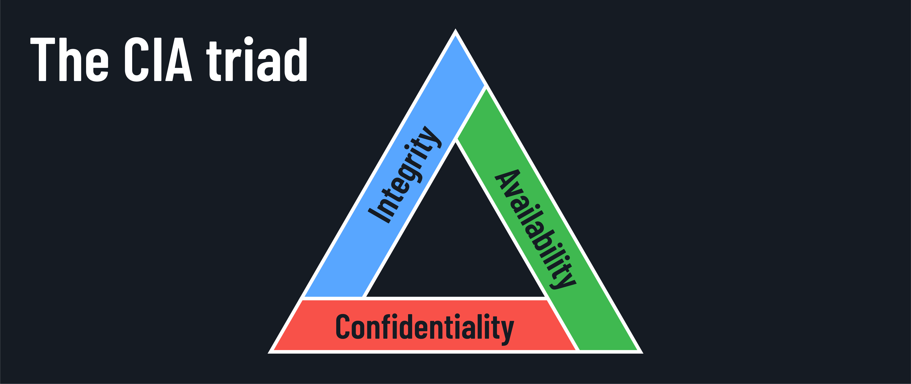

<h1>
  The CIA Triad
  Overview of the CIA Triad
</h1>

**Learning objective:** By the end of this lesson, students will be able to understand what the CIA triad is and how it fits into information security.

## What is the CIA triad?

The CIA triad is a fundamental concept in information security that consists of three key principles:

- **Confidentiality**
- **Integrity**
- **Availability**

Let's break down each component and understand its significance.

## Confidentiality: Keeping secrets secret

Confidentiality ensures that information is accessible only to authorized individuals. It's like having a secret diary that only you can read. In the digital world, confidentiality is maintained through various security measures such as:

- Encryption of sensitive data.
- Strong access controls.
- Proper authentication methods.
- Data classification.

## Integrity: Keeping information true

Integrity refers to the accuracy, consistency, and trustworthiness of data throughout its lifecycle. Imagine you're writing a recipe book. You want to ensure that the ingredients and instructions remain unchanged from the moment you write them down until someone uses them to cook a meal. Similarly, in information systems, integrity ensures that data remains unaltered by unauthorized parties and that any changes are detected and tracked. This can be done using:

- Hash functions to verify data.
- Digital signatures.
- Version control.
- Change management procedures.

## Availability: Keeping systems running

Availability guarantees that information is accessible to authorized users when they need it. Think of it as a reliable friend who's always there for you when you need them. In the context of IT systems, availability ensures that resources, services, and data are functioning and accessible to users without disruption. Some of the ways this is accomplished include:

- System redundancy.
- Backup power supplies.
- Regular maintenance.
- Disaster recovery planning.

  <h2 class="title">Overlapping security</h2>
  5 min

Some security measures can help achieve more than one of the CIA triad principles. For example, access controls not only help maintain confidentiality but also support the integrity of data:

- **Confidentiality:** Access controls restrict who can view sensitive information, ensuring only authorized users can access it.
- **Integrity:** Access controls also help maintain data integrity by preventing unauthorized users from modifying or deleting information.

Take a few minutes to think of other examples of security measures that can help achieve more than one of the CIA triad principles, and be prepared to share your ideas with the class.
